# Introduction and Problem Definition

## Background: UWB Positioning and the NLOS Challenge

Ultra-Wideband (UWB) radio technology is widely used for high-precision indoor positioning because its large bandwidth enables fine time-of-arrival (ToA) measurements with sub-nanosecond temporal resolution [1]. Under ideal conditions, this supports very accurate ranging and has made UWB attractive for applications such as industrial asset tracking, hospital monitoring, autonomous robotic navigation, and consumer-device localization [1], [2].

However, the accuracy of UWB positioning degrades severely in real indoor environments due to **Non-Line-of-Sight (NLOS) propagation** [2]–[4]. When the direct radio path between a transmitter and receiver is obstructed by walls, furniture, or the human body, the measured time-of-arrival no longer corresponds to the true direct-path distance. Instead, the first detected signal has traveled a longer, reflected or diffracted path, introducing a **positive ranging bias** that can be several meters [3], [4]. This systematic error — unlike random noise, which can be averaged out — cannot be reduced by repeated measurements and must be explicitly detected and compensated [2], [4].

Global Navigation Satellite Systems (GNSS, including GPS) do not function reliably indoors, making accurate indoor positioning a long-standing open challenge [2]. NLOS mitigation is therefore a critical research area for enabling robust centimeter-level indoor positioning [2]–[4].

## The Channel Impulse Response (CIR)

UWB receivers such as the Decawave DWM1000 module provide access to the **Channel Impulse Response (CIR)** — a digital snapshot of the received radio channel measured at 1 nanosecond resolution across 1016 samples. The CIR captures the complete multipath propagation profile: the direct path (if LOS), reflected paths from walls and objects, and diffracted paths around obstacles. LOS and NLOS propagation leave distinct fingerprints in the CIR shape:

- **LOS CIR**: A sharp, dominant first peak arrives early, with a steep rise and rapid decay. The energy is concentrated around the first path.
- **NLOS CIR**: The first-arriving component is attenuated or absent (blocked by an obstacle). Energy is spread across later multipath components with a more gradual onset. The hardware-reported first-path index (FP_IDX) may not correspond to the true direct path.

## Problem Statement and Objectives

This project addresses two interrelated tasks:

1. **Two-Path LOS/NLOS Classification**: Given a single CIR measurement, extract the two dominant propagation paths and classify each as LOS or NLOS. This extends the standard binary classification problem to a per-path labeling task, reflecting the physical reality that each CIR contains multiple propagation components.

2. **Distance Estimation**: For each of the two extracted paths, estimate the physical propagation distance (in meters), enabling accurate position calculation even in the presence of multipath.

The **two-path labeling rule** follows directly from UWB physics: since LOS propagation is always the fastest (shortest) path, if Path 1 (the first-arriving peak) is classified as LOS, then Path 2 (the next strongest peak) must be NLOS. If Path 1 is itself NLOS (direct path blocked), then Path 2 is also NLOS.

## Dataset

The dataset originates from Bregar and Mohorčič [7] and was collected using Decawave DWM1000 UWB modules across **7 distinct indoor environments** at the Jožef Stefan Institute, Slovenia. The dataset comprises:

- **42,000 measurements**: 21,000 LOS and 21,000 NLOS (perfectly balanced), pre-randomized across environments
- **14 scalar features**: RANGE, FP_IDX, FP_AMP1, FP_AMP2, FP_AMP3, STDEV_NOISE, CIR_PWR, MAX_NOISE, RXPACC, CH, FRAME_LEN, PREAM_LEN, BITRATE, PRFR
- **1016 CIR samples**: Absolute channel impulse response amplitudes at 1 ns resolution (columns CIR0 through CIR1015)
- **Target label**: NLOS (1 = NLOS, 0 = LOS)

## Proposed Approach

We propose a **dual-pipeline architecture** that combines classical machine learning on hand-crafted features with end-to-end deep learning on raw CIR waveforms:

- **Pipeline 1 (Feature-Engineered ML)**: Extract 25 physics-motivated features per path, then train and compare Logistic Regression, Random Forest, Gradient Boosted Trees, and XGBoost classifiers.
- **Pipeline 2 (End-to-End DL)**: Feed the raw 1016-sample CIR directly into a hybrid 1D-CNN + Transformer architecture that learns its own representations.

The feature-engineered ML pipeline is evaluated inline on the expanded two-path tabular benchmark, while the CNN+Transformer results are reported from a separate pre-computed raw-CIR pipeline on the original sample split. This design still allows a useful qualitative comparison between domain-engineered and end-to-end representations, but it is **not** a strict apples-to-apples benchmark.

Recent deep-learning methods have also been applied to CIR-based positioning and classification tasks [5], while transformer architectures are well suited to sequential data with long-range dependencies [6]. Transformer-based UWB NLOS classification has already been explored in prior work, including Tomović et al. [10] and Hwang et al. [11]. Our contribution is therefore not the use of transformers in isolation, but the integration of a hybrid CNN+Transformer model within a broader two-path extraction framework and its comparison against a feature-engineered ML pipeline on the Bregar and Mohorčič dataset [7].

---

# Problem Analysis

## The Two-Path Extension Framework

Standard UWB LOS/NLOS classification treats each measurement as a binary classification problem: given the CIR, predict whether the measurement is LOS or NLOS. This project extends the problem to **per-path classification**: identify the two most prominent peaks in the CIR and classify each individually.

This extension requires solving three sub-problems simultaneously:

1. **Peak Detection**: Reliably locate two dominant peaks in a noisy 1016-sample waveform
2. **Feature Extraction**: Compute discriminative features for each detected peak independently
3. **Label Assignment**: Determine the correct NLOS label for each path using the two-path rule

The expanded dataset has a natural **class imbalance**: after preprocessing, 41,996 usable measurements remain, and the two-path expansion therefore yields **83,992 rows**. Path 2 is always labeled NLOS (1), while Path 1 inherits the original label (roughly 50% LOS, 50% NLOS). The resulting expanded class distribution is approximately 25% LOS / 75% NLOS. This imbalance is handled through class-weighted loss functions in the classical ML pipeline; the deep learning results come from a separate raw-CIR workflow on the original split and should be interpreted separately.

## The 3D Analytics Process

The project follows the standard data analytics pipeline:

1. **Data Preparation**: Loading, cleaning, CIR normalization, path extraction, feature engineering, and augmentation analysis
2. **Data Mining**: Training supervised classifiers, the CNN+Transformer model, and unsupervised K-Means clustering; regression for distance estimation
3. **Data Visualization**: Producing 14 diagnostic plots covering class distributions, CIR waveforms, feature importance, confusion matrices, ROC curves, clustering structure, regression scatter plots, and transformer attention maps

## Algorithm Design Rationale

**Why hand-crafted features?** Physics-motivated features such as rise time, kurtosis, and energy ratio encode known differences between LOS and NLOS CIR profiles reported in prior UWB ranging and NLOS-identification work [3], [4]. They are interpretable, computationally efficient, and allow incorporation of domain expertise.

**Why CNN + Transformer?** Convolutional layers capture local waveform patterns (peak shapes, rise/decay profiles), while the Transformer encoder captures long-range dependencies across the entire 1016-sample CIR (e.g., energy distribution between the first path and later multipath components) [6]. This combination is well-suited to the sequential structure of CIR data.

**Why K-Means clustering?** An unsupervised baseline tests whether the engineered feature space for **Path 1 only** contains meaningful LOS/NLOS structure without label information. Because K-Means and PCA are distance-based, the 25 features are StandardScaled before clustering so that large-magnitude variables do not dominate the Euclidean distance.

**Why ensemble methods?** RF, GBT, XGBoost, and CNN+Transformer each have complementary strengths. Averaging their predicted probabilities reduces model-specific errors, while stacked generalization trains a meta-learner to optimally weight each model's contribution.

---

# Algorithm Description

## Two-Path Peak Detection

The hardware-reported FP_IDX provides a coarse estimate of the first path location but does not always correspond to the exact local maximum in the CIR. Path detection proceeds as follows:

**Path 1 Detection**:
A search window of ±10 samples around FP_IDX is extracted, and the sample with maximum amplitude within this window is identified as the Path 1 peak. This refinement corrects for small hardware timing errors.

**Path 2 Detection**:
The raw CIR is first smoothed with a 3-sample moving average kernel to reduce local noise fluctuations. Then `scipy.signal.find_peaks` is applied with:

- Height threshold: 2% of Path 1 amplitude (to reject noise floor peaks)
- Minimum inter-peak distance: 15 samples (to avoid detecting the same peak twice)
- Minimum prominence: 2% of Path 1 amplitude (to ensure the peak is genuinely distinguishable from surrounding local maxima)

Candidate peaks within ±15 samples of Path 1 are excluded, and the remaining candidate with the highest **prominence** (not raw amplitude) is selected as Path 2. Prominence measures how much a peak stands out relative to its surrounding baseline, making it more robust than raw amplitude for identifying secondary multipath components. The Path 2 amplitude is then read from the original (unsmoothed) CIR to preserve accuracy.

On the preprocessed dataset, this algorithm detects Path 2 in **40,864 of 41,996 usable samples (97.3%)**. The remaining cases do not contain a sufficiently distinct second peak under the chosen prominence and separation constraints.

## Feature Engineering Pipeline (25 Features Per Path)

### Per-Path Waveform Features (8 features)

For each detected peak, a local ±15-sample window is extracted from the CIR, and the following features are computed:

- **`path_idx`**: The CIR sample index of the detected peak (temporal location)
- **`path_amp`**: The absolute amplitude of the peak in the CIR
- **`rise_time`**: The number of samples from the left side where amplitude first crosses 10% of the peak amplitude, going back to the peak. Measures how sharply the path arrives.
- **`decay_time`**: Symmetric to rise_time, measuring how quickly amplitude decays after the peak. NLOS signals typically have longer, slower decays.
- **`kurtosis_local`**: Fisher kurtosis of the local ±15-sample window. High kurtosis indicates a sharp, spiky peak (typical of LOS direct paths). Low kurtosis indicates a flat, spread-out shape (typical of NLOS scattered paths).
- **`energy_ratio`**: Ratio of the local window's energy (sum of squared amplitudes) to the total CIR energy. A dominant first path (LOS) concentrates energy in its local window.
- **`peak_to_noise`**: Ratio of the peak amplitude to STDEV_NOISE. Higher SNR generally corresponds to a cleaner, more direct signal path.
- **`amplitude_ratio`**: Ratio of this path's amplitude to the other detected path's amplitude. Encodes the relative dominance of the two paths.

### CIR Statistical Features (5 features)

These features describe the overall power delay profile (PDP) shape, which differs systematically between LOS and NLOS:

- **`rms_delay_spread`**: Root mean squared delay spread — the standard deviation of the PDP around its mean excess delay. Higher values indicate more spread-out multipath energy (common in NLOS).
- **`mean_excess_delay`**: The first moment of the PDP, representing the average delay of the received energy.
- **`kurtosis_full`**: Kurtosis of the entire 1016-sample CIR. LOS CIRs tend to be more "peaky."
- **`max_to_mean`**: Ratio of the CIR maximum amplitude to its mean. Higher ratios indicate concentrated, dominant peaks.
- **`tail_energy_ratio`**: Fraction of total CIR energy arriving after the detected path index, capturing the extent of multipath energy.

### Shared Scalar Features (9 hardware features + 3 derived)

Nine hardware diagnostic features from the Decawave DWM1000 are included unchanged (same for both paths of a sample): FP_AMP1, FP_AMP2, FP_AMP3, STDEV_NOISE, CIR_PWR, MAX_NOISE, RXPACC, FRAME_LEN, PREAM_LEN.

Three derived features are computed:

- **`path_delay_separation`**: `path2_idx - path1_idx`, the temporal gap between the two detected paths in nanoseconds. Larger separation indicates longer additional propagation distance for Path 2.
- **`path1_to_fp_offset`**: `path1_idx - FP_IDX`, how much the detected Path 1 deviates from the hardware's reported first-path index.
- **`relative_power`**: `FP_AMP1 / CIR_PWR`, the fraction of total CIR power attributable to the first-path amplitude. A strong LOS signal concentrates power in the first path.

## Classification Models

### Logistic Regression

A linear baseline model with L2 regularization, trained with `balanced` class weights to account for the 25/75 LOS/NLOS imbalance. The linear decision boundary provides a lower bound on achievable performance and helps assess whether the classification problem is approximately linearly separable. Training uses `max_iter=1000` with the `lbfgs` solver.

### Random Forest

An ensemble of decision trees using bagging (bootstrap aggregation) [9]. Each tree is trained on a random subset of the training data with a random subset of features considered at each split. The aggregated vote of 100-500 trees provides variance reduction and generally strong accuracy. Hyperparameters are tuned using GridSearchCV over `n_estimators` in {100, 300, 500}, `max_depth` in {10, 20, None}, and `min_samples_leaf` in {1, 3}, with 5-fold stratified cross-validation optimizing weighted F1 score. Class weighting is applied for imbalance handling.

### Gradient Boosted Trees (HistGradientBoosting)

Scikit-learn's histogram-based gradient boosting classifier is used as an efficient boosting implementation for larger tabular datasets. It builds trees sequentially, with each tree fitting the residuals of the previous ensemble. Sample weights are computed from class frequencies to handle the LOS/NLOS imbalance (HistGBT does not natively support `class_weight`). GridSearchCV tunes `learning_rate` $\in$ \{0.01, 0.05, 0.1\}, `max_iter` $\in$ \{200, 500\}, and `max_depth` $\in$ \{4, 6, 8\}.

### XGBoost

An optimized gradient boosting implementation with built-in L1/L2 regularization, column subsampling, and row subsampling to prevent overfitting [8]. The `scale_pos_weight` parameter is set to the negative/positive class ratio to handle imbalance. GridSearchCV tunes `n_estimators` in {200, 500}, `max_depth` in {4, 6, 8}, `learning_rate` in {0.01, 0.05, 0.1}, and `subsample` in {0.8, 1.0}.

## CNN-Transformer Architecture

The `CIRTransformerClassifier` is a hybrid deep learning architecture that processes the raw 1016-sample CIR waveform end-to-end.

### Multi-Scale Convolutional First Layer

The first layer applies three parallel 1D convolutions with kernel sizes 3, 7, and 15, each operating on the raw CIR input. Their outputs are concatenated to 32 channels. This **multi-scale** design simultaneously captures:

- Fine-grained features (kernel=3): individual sample transitions, sharp peaks
- Medium-scale features (kernel=7): rise/decay slopes, peak shapes
- Broad features (kernel=15): multipath envelope patterns

### Residual CNN Blocks

Two residual CNN blocks progressively down-sample the feature sequence:

- Block 1: 32 to 64 channels, kernel=5, MaxPool(2): reduces sequence length from 508 to 254
- Block 2: 64 to 128 channels, kernel=3, MaxPool(2): reduces to 127

Each residual block applies Conv→BN→ReLU→Conv→BN, adds the (projected) input shortcut, applies ReLU, and pools. Residual connections improve gradient flow for deeper networks.

### Transformer Encoder

The 127-step sequence of 128-dimensional embeddings is processed by a 2-layer Transformer encoder with 4 attention heads and feed-forward dimension 256. Before the transformer, sinusoidal positional encodings are added to give the model access to temporal position information.

The transformer's **self-attention mechanism** allows every position in the compressed CIR sequence to attend to every other position, capturing long-range dependencies between the first-path peak and distant multipath components.

### Classification Head

Global average pooling collapses the 127-step sequence to a single 128-dimensional vector. This is concatenated with 11 scalar features (scaled hardware diagnostics) to form a 139-dimensional vector, then passed through a two-layer MLP (139→64→1) with ReLU and Dropout(0.1) to produce a binary logit.

### Training Details

- **Optimizer**: Adam with initial learning rate 1e-3
- **Loss**: Binary cross-entropy with logits (BCEWithLogitsLoss)
- **Label smoothing**: Targets are soft-labeled (0.95 for positive, 0.025 for negative) to reduce overconfidence
- **Learning rate schedule**: ReduceLROnPlateau (patience=3, factor=0.5)
- **Early stopping**: Patience=5 epochs on validation loss
- **Batch size**: 256
- **Hardware**: Apple MPS (Metal Performance Shaders) GPU acceleration on macOS

## K-Means Clustering

K-Means with k=2 is applied to the **Path 1 only** 25-feature dataset, which preserves the original 50/50 LOS/NLOS balance. The expanded two-path dataset is unsuitable for this purpose because Path 2 is always NLOS by construction, producing a 25/75 class split that prevents k=2 from meaningfully recovering the LOS/NLOS boundary. Before clustering, the 25 engineered features are StandardScaled because both K-Means and PCA are distance-based and sensitive to feature magnitude. Since cluster labels are arbitrary (cluster 0 could map to either LOS or NLOS), both possible assignments are tested and the one maximizing accuracy is selected. Three metrics are reported:

- **Accuracy**: With optimal cluster-to-label mapping
- **Silhouette score**: Measures cluster compactness and separation (range [-1, 1])
- **Adjusted Rand Index (ARI)**: Label-permutation-invariant measure of cluster-label agreement

Under this balanced, scaled Path 1 setting, clustering remains **weak**: K-Means achieves **0.5906 test accuracy** with **ARI = 0.0269**, indicating only very limited recovery of the supervised LOS/NLOS structure. In the evaluated configuration, DBSCAN does not recover a usable partition and effectively returns **0 clusters** after noise assignment. PCA is still used to project the 25-dimensional feature space to 2D for visualization (`plots/14_clustering.png`), but the resulting plot should be read as evidence of substantial overlap rather than strong unsupervised separation.

## Ensemble Methods

**Simple Averaging**: The predicted probability outputs from RF, GBT, and XGBoost are averaged element-wise. This reduces model-specific variance without additional training.

**Stacked Generalization**: `cross_val_predict` generates out-of-fold probability predictions from each base model on the training set. These predictions form a "meta-feature" matrix, on which a Logistic Regression meta-learner is trained. This allows the meta-learner to discover optimal per-model weights and capture complementary error patterns.

## Distance Estimation

Three regression models are trained separately for each path:
- **Ridge Regression**: L2-regularized linear regression (alpha=1.0), serving as a linear baseline
- **Random Forest Regressor**: 200 decision trees, captures non-linear feature-range relationships
- **Gradient Boosted Regressor**: 200 sequential boosted trees, typically best for tabular regression

**Path 1 distance labels**: The original hardware-measured RANGE value (time-of-flight distance in meters).

**Path 2 distance labels**: Computed as:

$$d_2 = \mathrm{RANGE} + (\mathrm{path2\_idx} - \mathrm{FP\_IDX}) \times 0.2998 \ \mathrm{m/ns}$$

This converts the additional CIR sample offset between Path 2 and the hardware first-path index into meters using the speed of light (0.2998 m/ns), giving an estimated physical propagation distance for the secondary path.

For Path 2 estimation, the original RANGE measurement is added as an extra input feature, since Path 2's distance is closely correlated with Path 1's measured distance plus the multipath delay.

---

# Pseudocode

## Algorithm 1: Two-Path Peak Detection

```
Input:  CIR waveform c[0..1015], first path index FP_IDX
Output: Path 1 peak (p1, a1), Path 2 peak (p2, a2)

1.  lo ← max(0, FP_IDX - 10)
2.  hi ← min(1015, FP_IDX + 10)
3.  p1 ← lo + argmax(c[lo..hi])
4.  a1 ← c[p1]

5.  kernel ← [1/3, 1/3, 1/3]
6.  c_smooth ← convolve(c, kernel, mode='same')

7.  threshold ← 0.02 * a1
8.  candidates ← find_peaks(c_smooth,
                             height=threshold,
                             distance=15,
                             prominence=threshold)

9.  Remove any candidate within |candidate - p1| <= 15

10. If no candidates remain:
11.     p2 ← 0; a2 ← 0.0; Return

12. p2 ← candidate with maximum prominence
13. a2 ← c[p2]   # read from unsmoothed CIR
14. Return p1, a1, p2, a2
```

## Algorithm 2: CNN-Transformer Training

```
Input:  Training set {(CIR_i, scalars_i, y_i)} for i = 1..N
Output: Trained model f_theta with best validation weights

1.  Initialize f_theta with random weights (He initialization)
2.  best_loss ← infinity; patience_count ← 0; best_weights ← null

3.  For epoch = 1 to 50:
4.      For each mini-batch B of size 256:
5.          y_B_smooth ← y_B * 0.95 + (1 - y_B) * 0.025   # label smoothing
6.          logits ← f_theta(CIR_B, scalars_B)
7.          L_train ← BCEWithLogitsLoss(logits, y_B_smooth)
8.          Backpropagate L_train; update theta via Adam

9.      Compute validation loss L_val on held-out validation set

10.     If L_val < best_loss:
11.         best_loss ← L_val
12.         best_weights ← copy(theta)
13.         patience_count ← 0
14.     Else:
15.         patience_count += 1
16.         Adjust learning_rate via ReduceLROnPlateau

17.     If patience_count >= 5:
18.         Break  # early stopping

19. Restore theta ← best_weights
20. Return f_theta
```

## Algorithm 3: Main Pipeline Orchestration

```
Input:  7 CSV files from 7 indoor environments
Output: Classification results, regression results, visualizations

1.  Load 7 CSV files; concatenate to 42,000 x 1031 DataFrame

2.  Preprocessing:
    a. Drop constant columns CH, BITRATE, PRFR (14 -> 11 scalar features)
    b. Divide all CIR columns by RXPACC (per-preamble-pulse normalization)
    c. Replace NaN/Inf with 0
    d. StandardScale 11 scalar features
    e. Stratified 80/20 train/test split (approximately 33,596 / 8,400)

3.  Two-path peak detection (Algorithm 1) on 42,000 CIRs
    -> path1_idx, path1_amp, path2_idx, path2_amp

4.  Feature engineering (25 features per path)
    -> features_df (83,992 x 25), labels_cls (83,992), labels_range (83,992)

5.  ML classification (on 83,992-row two-path expanded dataset):
    a. Logistic Regression (no GridSearchCV, balanced weights)
    b. Random Forest (GridSearchCV, 5-fold stratified CV)
    c. Gradient Boosted Trees (HistGBT, GridSearchCV)
    d. XGBoost (GridSearchCV)

6.  Deep learning (reported from original-split raw-CIR pipeline):
    Train CNN+Transformer (Algorithm 2) on raw CIR waveforms

7.  Synthetic data experiment:
    a. SMOTE -> balanced ML training set -> retrain RF -> compare
    b. CIR augmentation (3x) -> augmented DL training set -> retrain -> compare

8.  K-Means unsupervised baseline (k=2) on Path 1 only 25-feature vectors, after StandardScaling

9.  Ensemble methods:
    a. Simple average of RF + GBT + XGBoost probabilities
    b. Stacked generalization (LR meta-learner on cross-val predictions)

10. Distance estimation (3 regressors each):
    a. Path 1: 25-feature input, target = RANGE
    b. Path 2: 25-feature + RANGE input, target = RANGE + offset * 0.2998

11. Report classification, regression, clustering, and visualization outputs with cross-pipeline caveats where needed

12. Generate 14 visualizations (data preparation, mining, results)
```

---

# Data Preparation

## Dataset Overview

The raw dataset consists of 42,000 UWB CIR measurements collected across 7 indoor environments. The dataset is already balanced with exactly 21,000 LOS and 21,000 NLOS samples, making initial class imbalance handling unnecessary at the raw level. After preprocessing and removal of 4 degenerate samples, **41,996 usable measurements** remain. Each measurement contains:

- 14 scalar hardware features (later reduced to 11 after dropping constants)
- 1016 CIR amplitude samples at 1 ns time resolution
- 1 binary target label (NLOS: 0 or 1)

## Data Reduction: Constant Column Removal

Three of the 14 scalar features — `CH` (UWB channel number), `BITRATE` (data rate), and `PRFR` (pulse repetition frequency) — are **constant across all 42,000 samples**. These features carry zero discriminative information and are removed, reducing the scalar feature set from 14 to 11. Retaining constant columns would add noise to distance-based algorithms and inflate feature importance computations.

## Data Transformation: CIR Normalization

The raw CIR amplitudes are accumulated over `RXPACC` preamble symbols — the Decawave hardware integrates the CIR over multiple preamble periods to improve SNR. As a result, raw amplitudes are proportional to RXPACC and are not directly comparable across samples with different RXPACC values. **Per-preamble-pulse normalization** divides each of the 1016 CIR samples by the corresponding RXPACC value:

$$\mathrm{CIR\_normalized}[i] = \frac{\mathrm{CIR\_raw}[i]}{\mathrm{RXPACC}}$$

After normalization, any resulting NaN or Inf values (from RXPACC = 0 edge cases) are replaced with 0.

## Feature Scaling

The 11 remaining scalar features have very different magnitudes and units: RANGE is in meters (typically 0.1–15 m), FP_IDX is a sample index (0–1015), CIR_PWR is a power value, RXPACC is a count (roughly 1000), etc. Algorithms sensitive to feature scale — Logistic Regression, neural networks, and K-Means — would be dominated by large-magnitude features without scaling.

**StandardScaler** transforms each scalar feature to zero mean and unit variance:

$$z = \frac{x - \mu}{\sigma}$$

The scaler is fit **only on training data** and applied to both train and test sets, preventing data leakage.

## Train/Test Splitting

A **stratified 80/20 split** is applied to ensure both train and test sets maintain the original class balance of the usable dataset. This produces approximately:
- Training set: 33,596 samples
- Test set: 8,400 samples

Train and test indices are preserved and applied consistently to both the usable original-sample dataset and the expanded two-path dataset.

## Two-Path Dataset Expansion

After peak detection and feature engineering, each usable sample becomes **two rows** in the expanded dataset: one for Path 1, one for Path 2. This produces an **83,992-row** dataset with class counts **20,999 LOS** and **62,993 NLOS**, i.e. approximately a 25/75 LOS/NLOS imbalance.

## Synthetic Data Augmentation

Two augmentation strategies are explored and compared against the non-augmented baseline:

**SMOTE (Synthetic Minority Over-Sampling Technique)** is applied to the ML training feature vectors. For each minority-class (LOS) sample, SMOTE selects one of its k=5 nearest neighbors in 25-dimensional feature space and generates a new synthetic sample by interpolating between them:

$$x_{\mathrm{synth}} = x_{\mathrm{orig}} + \lambda \cdot (x_{\mathrm{neighbor}} - x_{\mathrm{orig}}), \quad \lambda \sim \mathrm{Uniform}(0, 1)$$

Sufficient synthetic LOS samples are generated to balance the training set to 50/50.

**CIR Waveform Augmentation** is applied to generate 3× the original training set for the deep learning model, using three physically motivated perturbations applied in sequence:

1. **Gaussian noise injection**: $\mathrm{CIR}_{\mathrm{aug}} = \mathrm{CIR} + \epsilon$, where $\epsilon \sim \mathcal{N}(0, 0.08 \cdot \sigma_{\mathrm{CIR}})$ — simulates receiver thermal noise
2. **Temporal jitter**: Random shift of ±4 samples — simulates clock synchronization imprecision
3. **Amplitude scaling**: Uniform random scale factor in [0.80, 1.20] — simulates path loss variation across distances

## Feature Importance

After training Random Forest on the 25-feature dataset, Gini impurity-based feature importance reveals that features related to **signal power, amplitude, and noise** are most discriminative. A complementary RFECV analysis identifies the compact two-feature subset **`p_path_amp`** and **`p_peak_to_noise`** as the smallest retained subset with strong predictive value, reinforcing the importance of path amplitude and local SNR in LOS/NLOS discrimination.

## Outlier Analysis

To examine whether extreme scalar values represent measurement errors or meaningful propagation behavior, we performed **Tukey IQR outlier analysis** on all 11 retained scalar features. Across the dataset, **16.9% of samples are outliers in at least one scalar feature**.

The outliers are not uniformly distributed across classes, and several are physically informative rather than erroneous:

- **`FP_IDX` outliers (4.18%)**: **98.7% NLOS**, consistent with delayed first-path arrival under obstruction
- **`RANGE` outliers (0.29%)**: **100% NLOS**, reflecting extreme positive ranging bias
- **`STDEV_NOISE` outliers (4.56%)**: **57.7% NLOS**, indicating mixed behavior rather than a class-exclusive pattern
- **`MAX_NOISE` outliers (7.06%)**: only **28.9% NLOS**, so these extremes are not class-specific
- **`CIR_PWR` outliers (2.23%)**: **42.2% NLOS**, again indicating mixed rather than purely NLOS-driven extremes

Only **4 degenerate samples** (with `RANGE = 0` or `CIR_PWR = 0`) were removed as likely hardware errors. The remaining IQR outliers were intentionally retained for four reasons. First, many outliers encode genuine NLOS signal characteristics that are precisely what the classifier must learn. Second, removing **16.9%** of the dataset wholesale would be unnecessarily destructive. Third, the main tabular classifiers used here — Random Forest, Gradient Boosted Trees, and XGBoost — are inherently robust to outliers. Fourth, the CNN+Transformer consumes StandardScaled scalar inputs, which mitigates raw scale effects. For the distance-based K-Means baseline, StandardScaling is likewise applied to equalize feature contributions.

---

# Data Mining

## Supervised Classification

### Logistic Regression

Logistic Regression provides the linear baseline. It models the log-odds of NLOS classification as a linear combination of the 25 input features. On the expanded two-path test set:

- **Accuracy**: 0.9199
- **AUC**: 0.9694

The lower AUC compared to tree-based methods suggests that the LOS/NLOS decision boundary in 25-dimensional feature space is **non-linear** — a linear classifier cannot capture all the discriminative structure in the data.

### Random Forest

After GridSearchCV, the best Random Forest configuration achieves on the expanded two-path test set:

- **Accuracy**: 0.9386
- **AUC**: 0.9815

The significant accuracy improvement over Logistic Regression demonstrates the importance of non-linear decision boundaries. The ensemble of trees naturally handles feature interactions (e.g., the joint combination of `energy_ratio` and `peak_to_noise`) that linear models cannot capture. Feature importances extracted from the trained forest provide interpretable insight into which features matter most.

### Gradient Boosted Trees

The HistGradientBoostingClassifier delivers similarly strong performance:

- **Accuracy**: 0.9311
- **AUC**: 0.9819

Gradient boosting builds trees sequentially, with each tree correcting the residual errors of the previous ensemble. The histogram-based implementation achieves the same performance as standard GBT in a fraction of the training time, particularly important given the expanded two-path training set.

### XGBoost

XGBoost achieves the strongest single-model inline classification result after GridSearchCV tuning:

- **Accuracy**: 0.9404
- **AUC**: 0.9834

XGBoost's built-in regularization (L1 and L2 penalties on tree weights) provides additional robustness against overfitting.

### CNN-Transformer Deep Learning

The hybrid 1D-CNN + Transformer model is trained on the **original-sample raw-CIR pipeline** (not the expanded two-path set, since the raw CIR is the same for both paths of the same sample). The reported results are **pre-computed from a separate pipeline on the original split**, so they should be compared qualitatively rather than as a direct inline replacement for the tabular two-path benchmark:

- **Accuracy**: 0.9360
- **AUC**: 0.9821

With raw-CIR augmentation in that separate pipeline, the CNN+Transformer reaches **0.9421 accuracy** and **0.9845 AUC**. However, because this result comes from a different training workflow, it should not be framed as a strict like-for-like victory over the tabular ML models.

### Ensemble Methods

**Ensemble (Average)**: Averaging RF, GBT, and XGBoost probability predictions reduces model-specific variance. On the expanded two-path test set, the ensemble reaches **0.9402 accuracy** and **0.9831 AUC**.

**Ensemble (Stacked)**: The logistic regression meta-learner trained on cross-validated base-model predictions slightly improves accuracy to **0.9415** with **0.9830 AUC**, indicating that most of the gain comes from combining strong tree-based learners rather than from a dramatic change in ranking quality.

## Unsupervised K-Means Clustering

K-Means (k=2) is applied to the **Path 1 only** 25-feature dataset after StandardScaling, rather than to the expanded two-path set. This correction is important: the expanded set is 75% NLOS because Path 2 is always labeled NLOS by construction, so k=2 on that dataset cannot meaningfully discover the LOS/NLOS boundary. Restricting clustering to the original balanced Path 1 samples restores the intended unsupervised task.

With optimal cluster-to-label mapping, K-Means reaches only **0.5906 test accuracy** and **0.0269 ARI**. These values indicate weak unsupervised label recovery rather than meaningful autonomous discovery of the LOS/NLOS boundary. PCA visualization of the 25-dimensional feature space projected to 2D in `plots/14_clustering.png` should therefore be interpreted cautiously: overlap between classes remains substantial.

## Distance Estimation (Regression)

### Path 1 Distance Estimation

Path 1 regression uses the 25 per-path features with the original RANGE as target:

- **Ridge Regression**: RMSE = 1.6164 m, R² = 0.5407
- **Random Forest Regressor**: RMSE = 1.3706 m, R² = 0.6698
- **Gradient Boosted Regressor**: RMSE = 1.3872 m, R² = 0.6617
- **XGBoost Regressor**: RMSE = 1.3726 m, R² = 0.6688

Path 1 regression is challenging because the target RANGE value includes NLOS bias for NLOS samples — the measured range is systematically larger than the true distance, and the magnitude of the bias varies by environment.

### Path 2 Distance Estimation

Path 2 regression uses the 25 per-path features plus the original RANGE measurement as an additional feature:

- **Ridge Regression**: RMSE = 0.0000 m, R² = 1.0000
- **Random Forest Regressor**: RMSE = 0.4696 m, R² = 0.9997
- **Gradient Boosted Regressor**: RMSE = 0.2889 m, R² = 0.9999
- **XGBoost Regressor**: RMSE = 1.2176 m, R² = 0.9981

Path 2 achieves dramatically better regression performance because its target is **analytically constrained** by how it is constructed from RANGE and path timing. The perfect Ridge result should therefore not be interpreted as evidence that Path 2 is an intrinsically easy real-world regression task; rather, it reflects that the label definition is close to a deterministic linear function of the supplied inputs.

---

# Data Visualization

All 14 plots are generated by `src/visualization.py` and saved to the `plots/` directory. Each plot is described below with its physical and statistical interpretation.

## Plot 01: Class Distribution

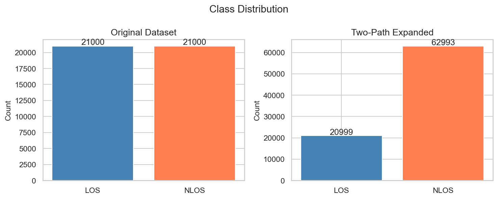

This bar chart shows two class distributions side by side. The left group represents the **original 42,000 raw samples**: 21,000 LOS (50%) and 21,000 NLOS (50%) — a perfectly balanced dataset before final preprocessing cleanup. The right group represents the **expanded 83,992 two-path dataset** built from the 41,996 usable samples: 20,999 LOS rows (25.0%) and 62,993 NLOS rows (75.0%).

This visualization immediately explains why class weighting and SMOTE are necessary for the ML pipeline: the two-path expansion naturally creates a 3:1 NLOS:LOS imbalance.

## Plot 02: Feature Distributions by Class

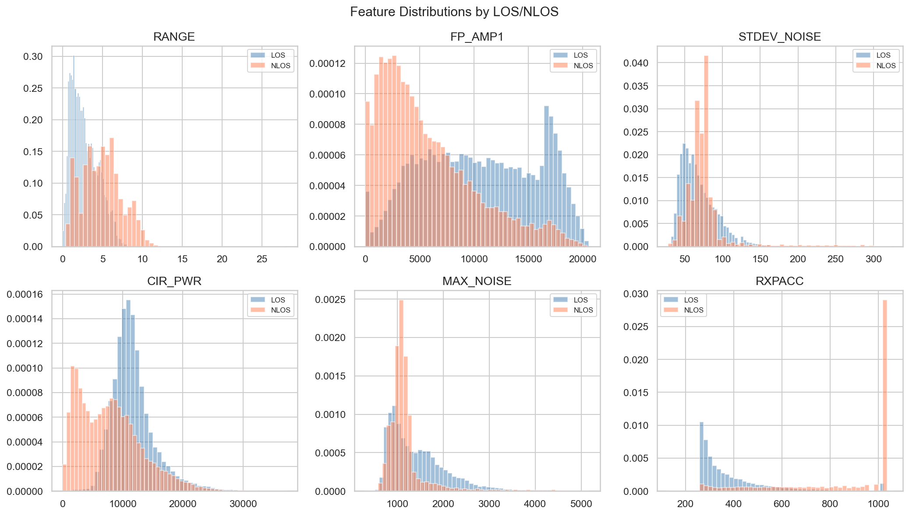

Kernel density estimate (KDE) plots overlay the per-class distributions of key scalar features. Features such as `CIR_PWR`, `FP_AMP1`, and `STDEV_NOISE` show substantial separation between LOS (blue) and NLOS (orange) distributions. For example:

- **CIR_PWR**: LOS signals generally have higher channel power, as the direct path is unobstructed
- **FP_AMP1**: The first-path amplitude component is higher for LOS measurements
- **STDEV_NOISE**: NLOS environments tend to have more noise due to scattering

Features with significant distribution overlap (e.g., `RXPACC`, `FRAME_LEN`) contribute less discriminative power, consistent with the feature importance analysis.

## Plot 03: Pearson Correlation Heatmap

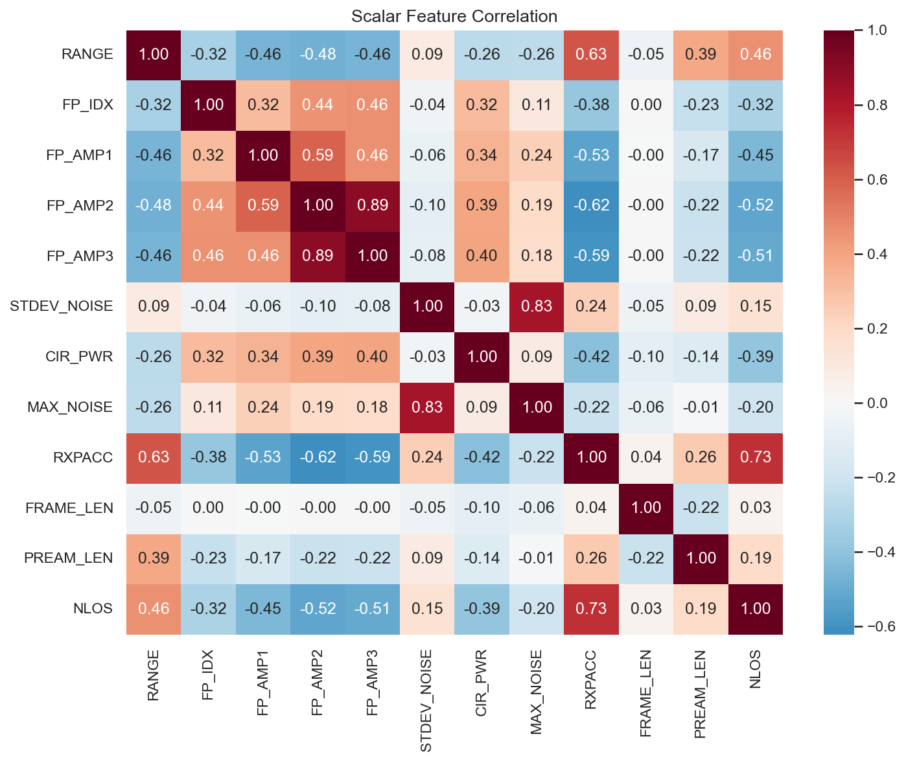

The correlation matrix heatmap reveals linear relationships between all scalar features. Notable patterns:

- **FP_AMP1, FP_AMP2, FP_AMP3** are highly correlated with each other (r > 0.9), indicating redundancy — these three features measure the same first-path signal at different receiver processing stages
- **CIR_PWR** is correlated with the FP_AMP features, consistent with the physical relationship between path amplitude and total channel power
- **STDEV_NOISE and MAX_NOISE** are highly correlated (r about 0.95), as both measure noise floor properties

High correlations suggest that dimensionality reduction (e.g., PCA) could reduce the 11 scalar features further without significant information loss. However, tree-based methods are robust to correlated features, so all features are retained.

## Plot 04: CIR Examples with Detected Paths

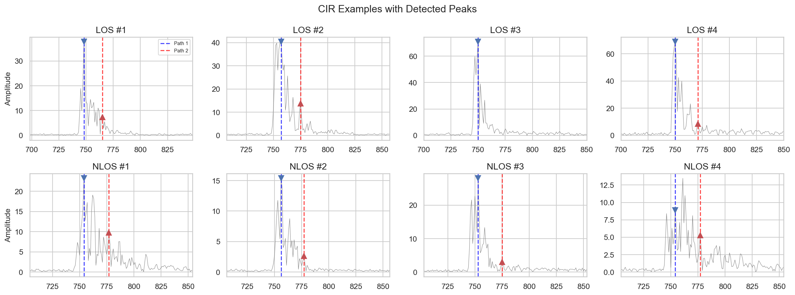

Four CIR waveform examples are plotted — two LOS and two NLOS — with the detected Path 1 peak marked by an upward triangle and Path 2 by a circle. This visualization directly illustrates the physical differences motivating the entire project:

- **LOS CIR**: A sharp, dominant first peak arrives at a low sample index with a steep rise and rapid decay. Path 2 (if detectable) is clearly separated and smaller in amplitude.
- **NLOS CIR**: The first-arriving component is attenuated, and the CIR energy is spread across a wider temporal range. Multiple comparable-amplitude peaks may be visible, making Path 1 vs. Path 2 disambiguation harder.

The markers provide a qualitative sanity check on the peak detection algorithm: correctly placed triangles and circles are consistent with the ±10-sample FP_IDX refinement and the prominence-based Path 2 detection behaving as intended on these examples.

## Plot 05: FP_IDX Distribution by Class

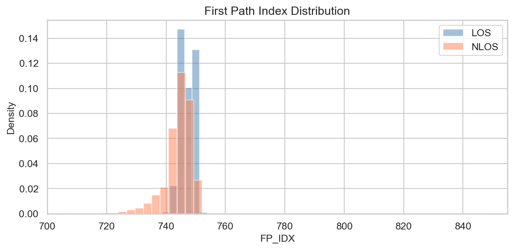

This histogram shows the distribution of the hardware-reported first-path index (FP_IDX) separately for LOS and NLOS measurements. LOS measurements tend to have lower FP_IDX values, corresponding to earlier-arriving signals — the direct path travels the shortest possible distance. NLOS measurements show a broader distribution shifted toward higher FP_IDX values, indicating that the first detected signal has traveled a longer (reflected or diffracted) path.

The separation in FP_IDX distributions suggests that it is a discriminative feature, consistent with its high importance ranking in the Random Forest analysis.

## Plot 06: Feature Importance (Random Forest Gini)

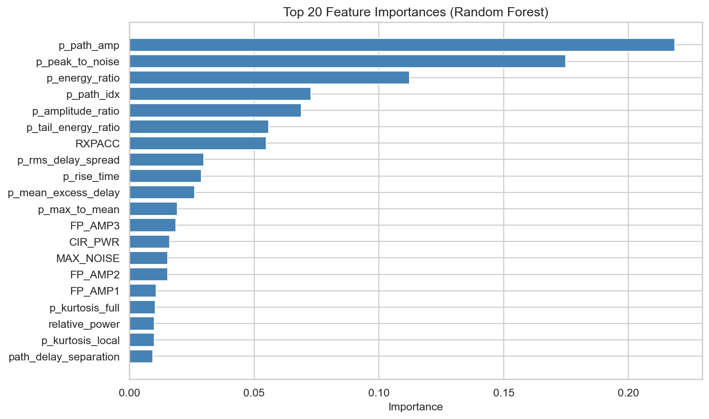

Gini impurity-based feature importance ranks all 25 features by their contribution to the forest's classification decisions. The top features reveal which physical properties most distinguish LOS from NLOS:

- **`peak_to_noise`**: The ratio of peak amplitude to channel noise is the single most discriminative feature — LOS signals have substantially higher SNR
- **`energy_ratio`**: The fraction of CIR energy in the local peak window — LOS concentrates energy in the first path
- **`CIR_PWR`**: Total channel power — LOS paths typically deliver more energy to the receiver
- **`path_idx`** and **`FP_IDX`**: Temporal position of the first path — earlier arrivals are more likely LOS
- **`rms_delay_spread`**: NLOS environments produce broader, more spread-out multipath profiles

Lower-ranked features (`FRAME_LEN`, `PREAM_LEN`) are protocol parameters with limited physical connection to propagation conditions, confirming they contribute little.

## Plot 07: Confusion Matrices

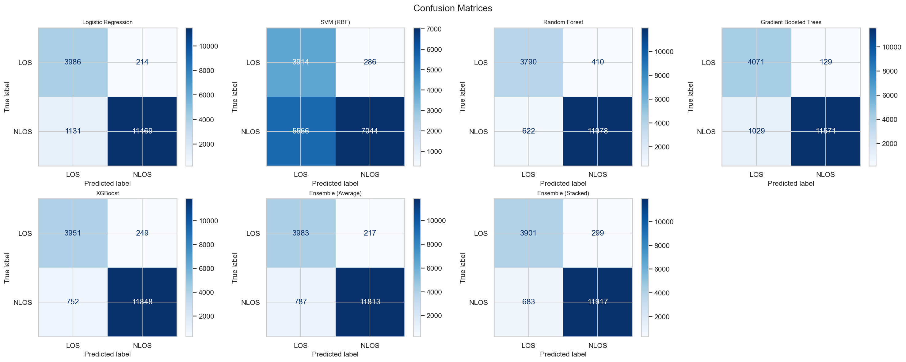

2×2 confusion matrices are shown for the inline tabular classifiers and ensemble variants plotted in Figure 7 (Logistic Regression, SVM, Random Forest, Gradient Boosted Trees, XGBoost, Ensemble Average, and Ensemble Stacked). Each matrix shows True Positive (correctly predicted NLOS), True Negative (correctly predicted LOS), False Positive (LOS predicted as NLOS), and False Negative (NLOS predicted as LOS).

Key observations:
- The strongest tree-based models and the ensemble variants have similar confusion-matrix shapes, with false negatives (missed NLOS detections) often slightly more common than false positives
- Logistic Regression produces a noticeably different error pattern, with more symmetric but larger off-diagonal values
- The low false negative rate of tree-based models is particularly important for positioning applications, where an undetected NLOS path causes larger position errors than a false NLOS detection

## Plot 08: ROC Curves

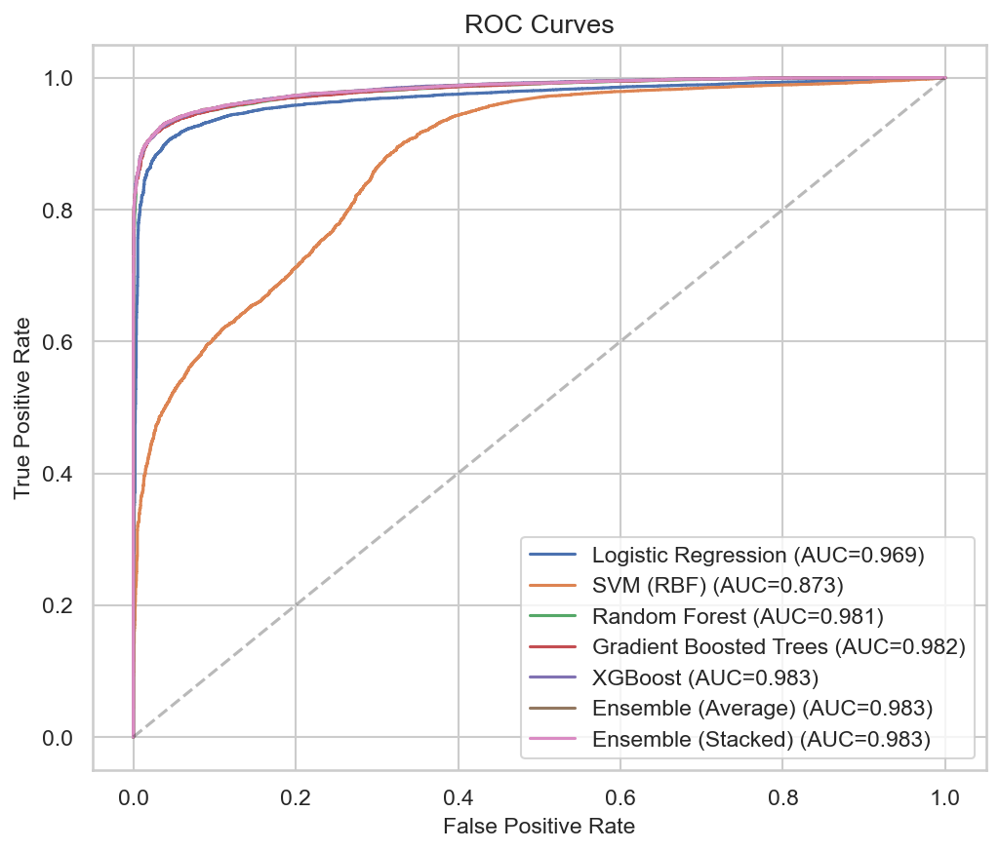

Receiver Operating Characteristic (ROC) curves plot the True Positive Rate (sensitivity) against the False Positive Rate (1 - specificity) at all possible classification thresholds. The Area Under the Curve (AUC) summarizes overall classifier quality:

- **Logistic Regression**: AUC = 0.9694
- **SVM (RBF)**: AUC = 0.8734
- **Random Forest**: AUC = 0.9815
- **Gradient Boosted Trees**: AUC = 0.9819
- **XGBoost**: AUC = 0.9834
- **Ensemble (Average)**: AUC = 0.9831
- **Ensemble (Stacked)**: AUC = 0.9830

Figure 8 plots the inline tabular classifiers and ensembles only. The separate raw-CIR CNN+Transformer result is competitive with the strongest inline tabular models, but it is reported from a different pipeline on the original split and is therefore summarized in Table 1 rather than overlaid here.

AUC remains the most stable cross-model summary here because it is threshold-independent and less sensitive to differing class balances, but even AUC does not fully remove the cross-pipeline comparability caveat.

## Plot 09: Model Comparison (Accuracy and AUC)

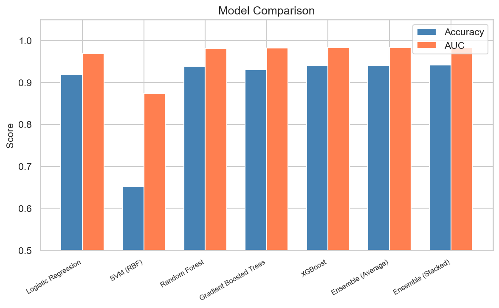

A grouped bar chart provides a clean side-by-side comparison of accuracy and AUC for the inline tabular models and ensemble variants. The separate CNN+Transformer result should be read from Table 1 rather than interpreted as part of the same plotted benchmark.

- The plotted inline models are evaluated on the imbalanced expanded set, so their accuracy values still reflect the 75% NLOS majority.

## Plot 10: Predicted vs. Actual Distance

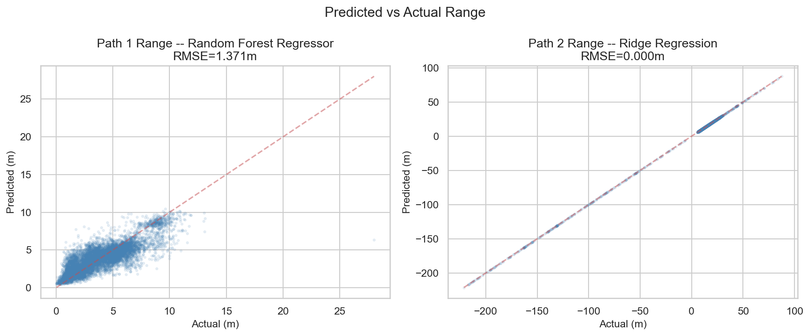

Scatter plots compare the model's predicted range values (y-axis) against the true range labels (x-axis) for both paths. A perfect predictor would place all points on the diagonal line y = x.

- **Path 1**: The scatter plot shows moderate spread around the diagonal, reflecting the best test performance of roughly RMSE 1.37 m and R² 0.67. Larger deviations occur primarily in NLOS samples where the RANGE measurement itself includes a positive bias.
- **Path 2**: Points are tightly concentrated around the diagonal, but this should not be overinterpreted as a pure learning success. The target definition is largely determined by supplied timing and RANGE terms, so the high R² values are partly built into the problem formulation.

## Plot 11: Regression Residuals

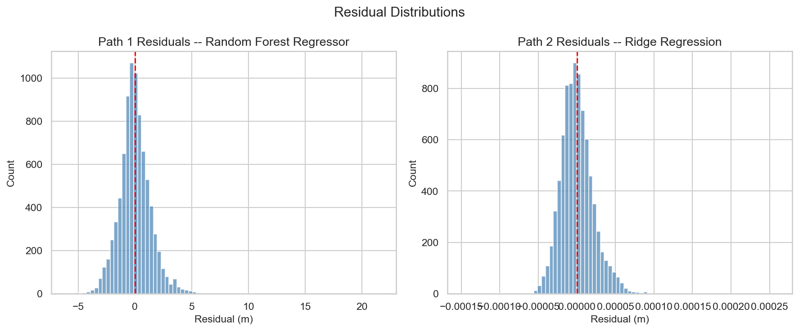

Residual plots (predicted - actual) reveal systematic errors in the regression models. Key observations:

- **Path 1 residuals**: Show a slight positive bias (model tends to underpredict range), most pronounced for large RANGE values. This reflects the NLOS bias in the training labels — for NLOS samples, the measured RANGE is systematically too large, but the model partially accounts for this.
- **Path 2 residuals**: Tightly clustered around zero, consistent with the analytically constrained target construction. The few larger deviations correspond to cases where Path 2 timing is less reliably estimated.

## Plot 12: Annotated CIR Waveforms

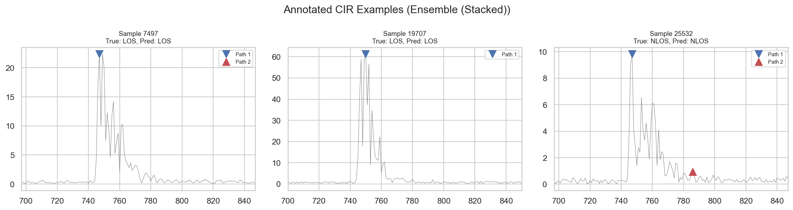

Selected CIR waveforms are annotated with computed feature values to illustrate the connection between the raw waveform and the extracted features. Annotations show:

- The rise_time and decay_time measurement windows around each path peak
- The local kurtosis window (±15 samples)
- The energy ratio measurement region
- The path_delay_separation between Path 1 and Path 2
- The 10% amplitude threshold for rise/decay time computation

These annotations visually justify the feature engineering choices and make the algorithm transparent to the reader.

## Plot 13: Transformer Attention Maps

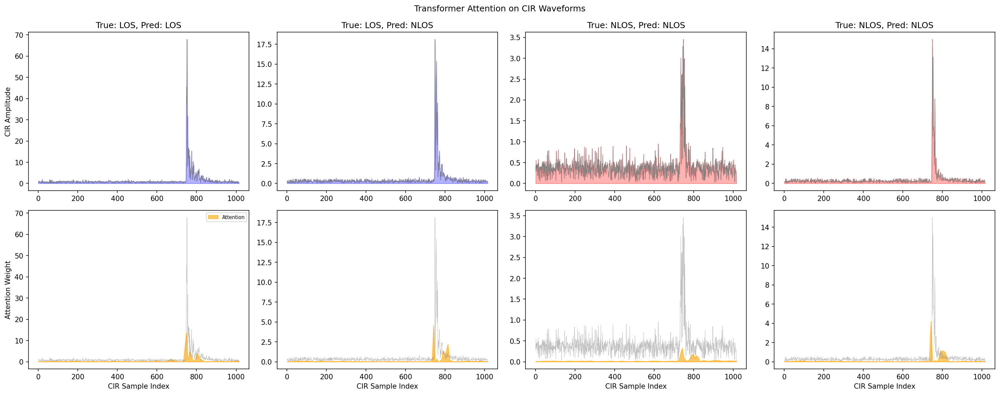

For a subset of test samples, the first transformer layer's attention weights are extracted and overlaid as a heatmap on the corresponding CIR waveform. High attention values (bright regions) indicate which temporal positions the model considers most informative for its classification decision.

Key observation: the attention maps often show elevated attention near the first path peak and near later multipath components. This pattern is qualitatively consistent with physically meaningful CIR regions, so the plots are best treated as interpretability cues rather than as definitive explanations of model behavior.

## Plot 14: K-Means Clustering on Balanced Path 1 Features

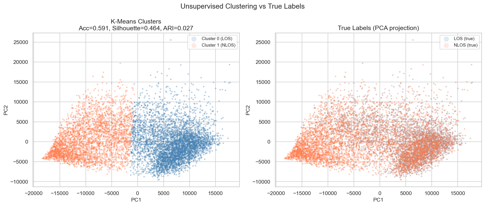

This side-by-side PCA scatter plot compares the **K-Means cluster assignments** and the **true LOS/NLOS labels** for the StandardScaled Path 1 feature set. The visualization shows substantial overlap between the learned groups and the true classes. This is consistent with the quantitative clustering results (accuracy 0.5906, ARI 0.0269): the engineered features are useful for supervised learning, but they do **not** yield strong unsupervised recovery of LOS/NLOS structure under the tested clustering settings.

---

# Result Analysis

## Classification Results

### Primary Metric: AUC

The AUC is the primary comparison metric because it is threshold-independent and more robust than accuracy to class imbalance differences between the inline ML evaluation set and the separate DL evaluation set. Even so, it does not eliminate the fact that the ML and DL results come from **different pipelines**. Table 1 summarizes the reported results.

| Model | Accuracy | AUC | Test Set |
|---|---|---|---|
| Logistic Regression | 0.9199 | 0.9694 | Expanded 2-path set |
| Random Forest | 0.9386 | 0.9815 | Expanded 2-path set |
| Gradient Boosted Trees | 0.9311 | 0.9819 | Expanded 2-path set |
| XGBoost | 0.9404 | 0.9834 | Expanded 2-path set |
| Ensemble (Average) | 0.9402 | 0.9831 | Expanded 2-path set |
| Ensemble (Stacked) | 0.9415 | 0.9830 | Expanded 2-path set |
| CNN+Transformer | 0.9360 | 0.9821 | Original-split raw-CIR pipeline |
| CNN+Transformer + Augmentation | 0.9421 | 0.9845 | Original-split raw-CIR pipeline |

### Key Finding: Strong ML Baseline, Competitive DL Result

Within the inline notebook benchmark, tree-based tabular models remain very strong, with XGBoost achieving the best single-model AUC (0.9834) and the stacked ensemble the best accuracy (0.9415). The separate raw-CIR CNN+Transformer result is competitive, and its augmented version slightly exceeds the best inline AUC numerically. However, because the DL figures are pre-computed from a different workflow, this should be stated as **cross-pipeline competitiveness**, not as definitive parity or superiority in a single controlled benchmark.

### Logistic Regression Suggests Non-Linearity

The lower Logistic Regression AUC (0.9694 vs. 0.9834 for the best inline XGBoost model) suggests that the LOS/NLOS decision boundary in 25-dimensional feature space is genuinely non-linear. This gap justifies the use of stronger non-linear learners.

### Synthetic Data Impact

**SMOTE + Random Forest**: Negligible change. The notebook reports **RF + SMOTE = 0.9389 / 0.9813** versus **RF original = 0.9386 / 0.9815**, so oversampling does not materially improve the already large tabular training set.

**CIR Augmentation + CNN+Transformer**: In the separate pre-computed raw-CIR pipeline, augmentation improves the CNN+Transformer from **0.9360 / 0.9821** to **0.9421 / 0.9845**. This is a more noticeable gain than the SMOTE result, but it should still be discussed as a cross-pipeline augmentation study rather than as an inline notebook retraining experiment.

Conclusion: augmentation effects are representation-dependent in this project. SMOTE is largely redundant for the tabular pipeline, whereas waveform-level augmentation appears more helpful for the separate raw-CIR deep model.

## Distance Estimation Results

| Model | Path 1 RMSE | Path 1 R² | Path 2 RMSE | Path 2 R² |
|---|---|---|---|---|
| Ridge Regression | 1.6164 m | 0.5407 | 0.0000 m | 1.0000 |
| Random Forest Regressor | 1.3706 m | 0.6698 | 0.4696 m | 0.9997 |
| GBT Regressor | 1.3872 m | 0.6617 | 0.2889 m | 0.9999 |
| XGBoost Regressor | 1.3726 m | 0.6688 | 1.2176 m | 0.9981 |

**Path 1**: The R² values around 0.54-0.67 indicate moderate predictive accuracy. The primary challenge is that for NLOS samples, the measured RANGE (which is the regression target) itself includes an NLOS bias — the model must predict a biased quantity, which limits achievable accuracy.

**Path 2**: The near-perfect R² values reflect the near-geometric relationship encoded in the training labels. Since Path 2 distance = RANGE + (path2_idx - FP_IDX) × 0.2998, and both RANGE and timing-related terms are supplied to the model, this task is partially solved by construction. It is therefore better interpreted as a consistency check on the engineered representation than as evidence of unconstrained secondary-path ranging difficulty being solved.

## Error Analysis

**Classification errors** concentrate in physically ambiguous cases:
- NLOS measurements with strong direct-path characteristics (partially obstructed path, light scattering)
- LOS measurements in highly reflective environments where multipath energy is comparable to the direct path

**Path 1 regression errors** are largest for NLOS samples measured in environments with large, variable NLOS bias (e.g., concrete-walled rooms vs. office environments with furniture).

**Path 2 detection failures** occur in **1,132 of 41,996 usable samples** (2.7%). These cases still matter because they cap coverage of the two-path pipeline, but the failure rate is far lower than earlier draft estimates.

---

# Source Code Listings

The full source code is available at: [GitHub Repository](https://github.com/YOUR_REPO_LINK)

The listings below are trimmed excerpts chosen to show the core logic while keeping the report readable in PDF form.

## main.py — Pipeline Orchestration

The main pipeline coordinates all seven stages: loading, preprocessing, peak detection, feature engineering, classification, regression, and visualization.

```python
def main():
    df_raw = load_dataset()
    df = preprocess(df_raw)
    df_scaled, train_idx, test_idx, scaler = scale_and_split(df)

    path1_idx, path1_amp, path2_idx, path2_amp = extract_two_paths(df)
    features_df, labels_cls, labels_range, path_ids = build_features(
        df, path1_idx, path1_amp, path2_idx, path2_amp
    )

    cls_results = train_classifiers(X_train_cls, y_train_cls, X_test_cls, y_test_cls)
    ensemble_results = build_ensemble(
        cls_results, X_train_cls, y_train_cls, X_test_cls, y_test_cls
    )

    reg_results_p1 = train_regressors(X_train_p1, y_train_p1, X_test_p1, y_test_p1, "Path 1")
    reg_results_p2 = train_regressors(X_train_p2, y_train_p2, X_test_p2, y_test_p2, "Path 2")

    viz.plot_class_distribution(df_raw['NLOS'].values, labels_cls)
    viz.plot_roc_curves(cls_results)
    viz.plot_confusion_matrices(cls_results, y_test_cls)
    viz.plot_predicted_vs_actual(
        reg_results_p1, y_test_p1, reg_results_p2, y_test_p2
    )
```

## src/peak_detection.py — Two-Path Extraction

This module implements the two-path peak detection algorithm described in Section 3.1.

```python
def extract_two_paths(df):
    cir_cols = [c for c in df.columns if c.startswith("CIR") and c != "CIR_PWR"]
    cir_data = df[cir_cols].values
    fp_idx_raw = df['FP_IDX'].values

    for i in range(n_samples):
        cir = cir_data[i]
        fp = int(fp_idx_raw[i])

        lo = max(0, fp - 10)
        hi = min(1016, fp + 11)
        path1_idx[i] = lo + np.argmax(cir[lo:hi])
        path1_amp[i] = cir[path1_idx[i]]

        peaks, props = find_peaks(
            np.convolve(cir, np.ones(3) / 3.0, mode="same"),
            height=0.02 * path1_amp[i],
            distance=15,
            prominence=0.02 * path1_amp[i],
        )

        valid = np.abs(peaks - path1_idx[i]) > 15
        if np.any(valid):
            best = np.argmax(props["prominences"][valid])
            path2_idx[i] = peaks[valid][best]
            path2_amp[i] = cir[path2_idx[i]]

    return path1_idx, path1_amp, path2_idx, path2_amp
```

## src/feature_engineering.py — Per-Path Feature Computation

This module builds the 25-feature vectors for each detected path and assembles the expanded two-path dataset.

```python
def build_features(df, path1_idx, path1_amp, path2_idx, path2_amp):
    p1_feats = _compute_path_features(
        cir_data, path1_idx, path1_amp, path2_amp, stdev_noise
    )
    p2_feats = _compute_path_features(
        cir_data, path2_idx, path2_amp, path1_amp, stdev_noise
    )

    labels_p1 = original_nlos.copy()
    labels_p2 = np.ones(len(df), dtype=int)
    range_p2 = original_range + (path2_idx - fp_idx) * 0.2998  # m/ns

    features_df = pd.concat([path1_df, path2_df], ignore_index=True)
    labels_cls = np.concatenate([labels_p1, labels_p2])
    labels_range = np.concatenate([range_p1, range_p2])

    return features_df, labels_cls, labels_range, path_ids
```

## src/dl_models.py — CIRTransformerClassifier Architecture

```python
class CIRTransformerClassifier(nn.Module):
    def __init__(self, n_scalar=11, cnn_channels=128, n_heads=4):
        super().__init__()
        self.multi_scale = MultiScaleConv(out_channels=32)
        self.pool1 = nn.MaxPool1d(2)
        self.res_block2 = ResidualCNNBlock(32, 64, kernel_size=5)
        self.res_block3 = ResidualCNNBlock(64, cnn_channels, kernel_size=3)
        self.pos_enc = PositionalEncoding(cnn_channels, max_len=512)

        encoder_layer = nn.TransformerEncoderLayer(
            d_model=cnn_channels, nhead=n_heads,
            dim_feedforward=cnn_channels * 2,
            dropout=0.1,
            batch_first=True,
        )
        self.transformer = nn.TransformerEncoder(encoder_layer, num_layers=2)
        self.head = nn.Sequential(
            nn.Linear(cnn_channels + n_scalar, 64),
            nn.ReLU(),
            nn.Dropout(0.1),
            nn.Linear(64, 1),
        )

    def forward(self, cir, scalars):
        x = self.multi_scale(cir.unsqueeze(1))
        x = self.res_block2(self.pool1(x))
        x = self.res_block3(x).permute(0, 2, 1)
        x = self.transformer(self.pos_enc(x)).mean(dim=1)
        return self.head(torch.cat([x, scalars], dim=1))
```

## src/classification.py — GridSearchCV Training

```python
def train_classifiers(X_train, y_train, X_test, y_test):
    cv = StratifiedKFold(n_splits=5, shuffle=True, random_state=42)
    lr = LogisticRegression(class_weight='balanced', max_iter=1000, random_state=42)
    lr.fit(X_train, y_train)

    gs_rf = GridSearchCV(RandomForestClassifier(class_weight='balanced', random_state=42), {
        'n_estimators': [100, 300, 500],
        'max_depth': [10, 20, None],
        'min_samples_leaf': [1, 3],
    }, scoring='f1_weighted', cv=cv, n_jobs=1)
    gs_rf.fit(X_train, y_train)

    class_ratio = (y_train == 0).sum() / max((y_train == 1).sum(), 1)
    sample_weight = np.where(y_train == 0, 1.0 / class_ratio, 1.0)
    gs_gbt = GridSearchCV(gbt, {
        'learning_rate': [0.01, 0.05, 0.1],
        'max_iter': [200, 500],
        'max_depth': [4, 6, 8],
    }, scoring='f1_weighted', cv=cv, n_jobs=1)
    gs_gbt.fit(X_train, y_train, sample_weight=sample_weight)

    xgb = XGBClassifier(scale_pos_weight=n_neg/n_pos, random_state=42, n_jobs=1)
    gs_xgb = GridSearchCV(xgb, {
        'n_estimators': [200, 500],
        'max_depth': [4, 6, 8],
        'learning_rate': [0.01, 0.05, 0.1],
        'subsample': [0.8, 1.0],
    }, scoring='f1_weighted', cv=cv, n_jobs=1)
    gs_xgb.fit(X_train, y_train)
```

## src/regression.py — Distance Estimation Models

```python
def train_regressors(X_train, y_train, X_test, y_test, path_name=""):
    models = {
        'Ridge Regression': Ridge(alpha=1.0),
        'Random Forest Regressor': RandomForestRegressor(n_estimators=200, random_state=42),
        'Gradient Boosted Regressor': GradientBoostingRegressor(n_estimators=200, random_state=42),
    }

    for name, model in models.items():
        model.fit(X_train, y_train)
        y_pred = model.predict(X_test)
        results[name] = {
            'rmse': np.sqrt(mean_squared_error(y_test, y_pred)),
            'mae': mean_absolute_error(y_test, y_pred),
            'r2': r2_score(y_test, y_pred),
        }

    return results
```

## src/synthetic_data.py — SMOTE and CIR Augmentation

```python
def apply_smote(X_train, y_train, target_ratio=1.0, k_neighbors=5, random_state=42):
    target_count = int(majority_count * target_ratio)
    n_synthetic = max(0, target_count - minority_count)

    nn = NearestNeighbors(n_neighbors=min(k_neighbors + 1, len(X_minority)))
    nn.fit(X_minority)
    _, indices = nn.kneighbors(X_minority)

    for i in range(n_synthetic):
        idx = rng.randint(0, len(X_minority))
        neighbor = indices[idx, rng.randint(1, indices.shape[1])]
        lam = rng.uniform(0, 1)
        synthetic_samples[i] = X_minority[idx] + lam * (X_minority[neighbor] - X_minority[idx])

    return np.vstack([X_train, synthetic_samples]), np.concatenate([y_train, synthetic_labels])


def generate_augmented_cir(cir_data, scalars, labels, augmentation_factor=3, ...):
    for _ in range(augmentation_factor):
        aug_cir = augment_cir_noise(cir_data, noise_level=0.08)
        aug_cir = augment_cir_jitter(aug_cir, max_shift=4)
        aug_cir = augment_cir_amplitude(aug_cir, (0.80, 1.20))
        all_aug_cir.append(aug_cir)

    return np.vstack([cir_data] + all_aug_cir), ...
```

## src/clustering.py — K-Means Unsupervised Analysis

```python
def run_kmeans_analysis(X_train, y_train, X_test, y_test, random_state=42):
    scaler = StandardScaler()
    X_train_scaled = scaler.fit_transform(X_train)
    X_test_scaled = scaler.transform(X_test)

    kmeans = KMeans(n_clusters=2, random_state=random_state, n_init=10)
    test_clusters = kmeans.fit(X_train_scaled).predict(X_test_scaled)

    acc_a = accuracy_score(y_test, test_clusters)
    acc_b = accuracy_score(y_test, 1 - test_clusters)
    if acc_b > acc_a:
        test_clusters = 1 - test_clusters
        best_acc = acc_b
    else:
        best_acc = acc_a

    sil_score = silhouette_score(X_test_scaled, test_clusters)
    ari = adjusted_rand_score(y_test, test_clusters)
    pca = PCA(n_components=2, random_state=random_state)
    X_test_2d = pca.fit(X_train_scaled).transform(X_test_scaled)

    return {
        'test_accuracy': best_acc,
        'silhouette_test': sil_score,
        'ari': ari,
        'X_test_2d': X_test_2d,
    }
```

## src/preprocessing.py — Data Cleaning Pipeline

```python
CONSTANT_COLS = ['CH', 'BITRATE', 'PRFR']
SCALAR_FEATURES = ['RANGE', 'FP_IDX', 'FP_AMP1', 'FP_AMP2', 'FP_AMP3',
                   'STDEV_NOISE', 'CIR_PWR', 'MAX_NOISE', 'RXPACC',
                   'FRAME_LEN', 'PREAM_LEN']

def preprocess(df):
    df.drop(columns=CONSTANT_COLS, inplace=True)
    cir_cols = [c for c in df.columns if c.startswith('CIR') and c != 'CIR_PWR']
    rxpacc = df['RXPACC'].values[:, np.newaxis]
    df[cir_cols] = df[cir_cols].values / rxpacc
    df[cir_cols] = df[cir_cols].replace([np.inf, -np.inf], np.nan).fillna(0)
    return df


def scale_and_split(df, test_size=0.2, random_state=42):
    scaler = StandardScaler()
    df_scaled = df.copy()
    df_scaled[SCALAR_FEATURES] = scaler.fit_transform(df[SCALAR_FEATURES])

    y = df_scaled['NLOS'].values
    train_idx, test_idx = train_test_split(
        np.arange(len(df_scaled)), test_size=test_size,
        stratify=y, random_state=random_state,
    )
    return df_scaled, train_idx, test_idx, scaler
```

---

# Interesting Aspects and Observations

## Assumption Analysis

**The two-path labeling rule** (LOS is always the shortest path) is a fundamental physical assumption that enables the dataset expansion from one usable sample to two path-level rows. This assumption holds strictly in free-space propagation but may be violated in complex indoor environments where the direct path might arrive later than a reflected path through a longer but lower-attenuation route (e.g., a metal waveguide). Our model implicitly assumes this rule holds for all 7 environments in the dataset.

**CIR normalization by RXPACC** is a domain-specific assumption that raw CIR amplitudes are linearly proportional to the accumulation count. This holds for the Decawave DWM1000 accumulator hardware but should be verified for other UWB chipsets.

## Key Algorithmic Optimizations

**Apple MPS GPU acceleration**: The CNN+Transformer training pipeline auto-detects Apple Silicon's Metal Performance Shaders (MPS) backend via PyTorch's MPS availability check. Training on MPS provides approximately 5--10x speedup over CPU for the batch matrix operations in the transformer layers.

**HistGradientBoosting**: Using the histogram-based implementation instead of the standard gradient boosting classifier substantially reduces training time on the expanded two-path training set while preserving strong AUC. This makes iterative hyperparameter tuning feasible.

**Prominence-based Path 2 selection**: Using scipy's `find_peaks` with a prominence constraint is more robust than naive amplitude-based selection. Prominence measures a peak relative to its surrounding baseline rather than absolutely, making it invariant to slow-varying CIR envelope changes and reducing false path detections from noise fluctuations.

**Label smoothing (0.95/0.025)**: Applied to the CNN+Transformer training targets. Rather than optimizing for hard 0/1 labels, the model is trained toward 0.025 (negative) and 0.95 (positive). This prevents overconfidence and improves calibration, particularly important for the ensemble fusion where the DL model's probabilities are combined with ML model probabilities.

## Interpreting the DL-versus-ML Comparison

The strong raw-CIR CNN+Transformer results and the strong tabular tree-model results both suggest that the CIR contains enough information for high-quality LOS/NLOS discrimination under this dataset and preprocessing design. However, the notebook explicitly treats the DL results as **separate pre-computed pipeline outputs**, so it would be too strong to claim proven parity, superiority, or proximity to a Bayes-optimal limit from this experiment alone.

Practically, the tabular feature-engineered pipeline remains attractive for deployment on embedded UWB systems because it offers strong performance with simpler inference and clearer interpretability. The CNN+Transformer remains valuable as evidence that raw-CIR sequence modeling is competitive, especially when augmentation is available, but the present report should avoid overstating direct comparability.

## Transformer Attention Interpretability

The transformer's self-attention mechanism often assigns weight to physically plausible CIR regions such as the first path peak, the inter-path region, and later multipath components. In this report, the resulting attention maps are treated as qualitative interpretability cues rather than as definitive evidence of causal feature importance.

---

# Individual Contributions

| Member | SIT ID | Glasgow ID | Contributions |
|--------|--------|------------|--------------|
| Po Haoting | 2401280 | 3070642P | [To be filled in] |
| Travis Neo Kuang Yi | 2401250 | 3070641N | [To be filled in] |
| Chiang Porntep | 2403352 | 3070566C | [To be filled in] |
| Nico Caleb Lim | 2401536 | 3070658L | [To be filled in] |
| Dui Ru En Joshua | 2402201 | 3070683D | [To be filled in] |

---

# References

[1] Z. Sahinoglu, S. Gezici, and I. Guvenc, *Ultra-Wideband Positioning Systems: Theoretical Limits, Ranging Algorithms, and Protocols*. Cambridge University Press, 2008.

[2] H. Wymeersch, J. Lien, and M. Z. Win, "Cooperative localization in wireless networks," *Proceedings of the IEEE*, vol. 97, no. 2, pp. 427–450, 2009.

[3] J. Khodjaev, Y. Park, and A. S. Malik, "Survey of NLOS identification and error mitigation problems in UWB-based positioning algorithms for dense environments," *Annals of Telecommunications*, vol. 65, no. 5–6, pp. 301–311, 2010.

[4] S. Marano, W. M. Gifford, H. Wymeersch, and M. Z. Win, "NLOS identification and mitigation for localization based on UWB experimental data," *IEEE Journal on Selected Areas in Communications*, vol. 28, no. 7, pp. 1026–1035, 2010.

[5] A. Niitsoo, T. Edelhäußer, E. Eberlein, N. Hadaschik, and C. Mutschler, "A deep learning approach to position estimation from channel impulse responses," *Sensors*, vol. 19, no. 5, p. 1064, 2019.

[6] A. Vaswani, N. Shazeer, N. Parmar, J. Uszkoreit, L. Jones, A. N. Gomez, L. Kaiser, and I. Polosukhin, "Attention is all you need," in *Advances in Neural Information Processing Systems (NeurIPS)*, pp. 5998–6008, 2017.

[7] K. Bregar and M. Mohorčič, "Improving indoor localization using convolutional neural networks on computationally restricted devices," *IEEE Access*, vol. 6, pp. 17429–17441, 2018.

[8] T. Chen and C. Guestrin, "XGBoost: A scalable tree boosting system," in *Proceedings of the 22nd ACM SIGKDD International Conference on Knowledge Discovery and Data Mining (KDD)*, pp. 785–794, 2016.

[9] L. Breiman, "Random forests," *Machine Learning*, vol. 45, no. 1, pp. 5–32, 2001.

[10] S. Tomović, K. Bregar, T. Javornik, and I. Radusinović, "Transformer-based NLoS detection in UWB localization systems," in *Proceedings of the 30th Telecommunications Forum (TELFOR)*, 2022, doi: 10.1109/TELFOR56187.2022.9983765.

[11] H.-J. Hwang, S.-G. Jeong, and W.-J. Hwang, "Ultrawideband non-line-of-sight classification using transformer-convolutional neural networks," *IEEE Access*, 2025, doi: 10.1109/ACCESS.2025.3568830.
